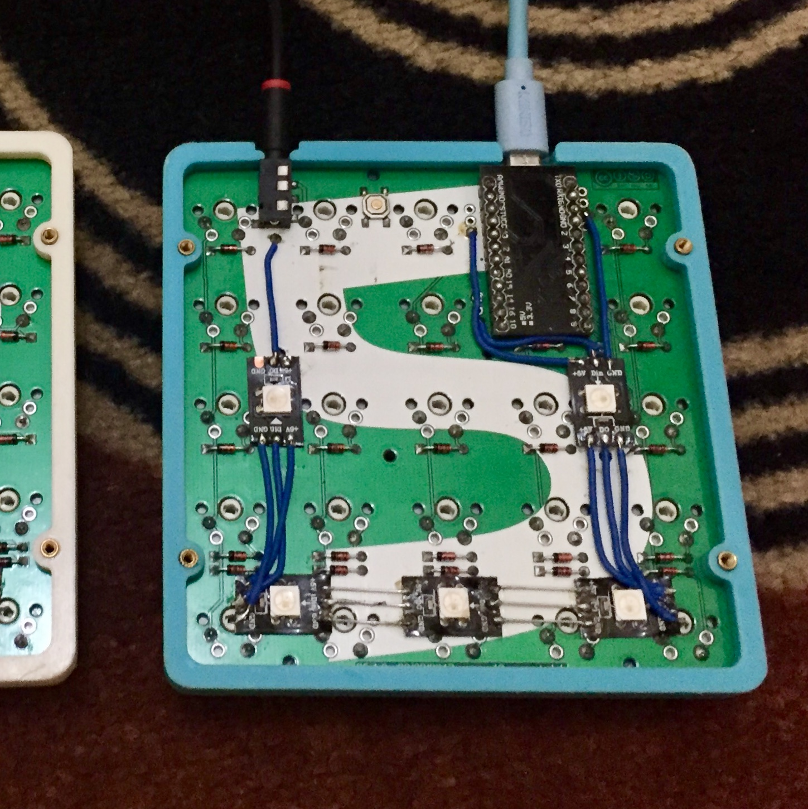
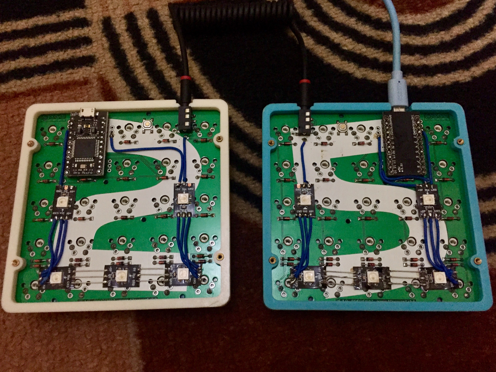
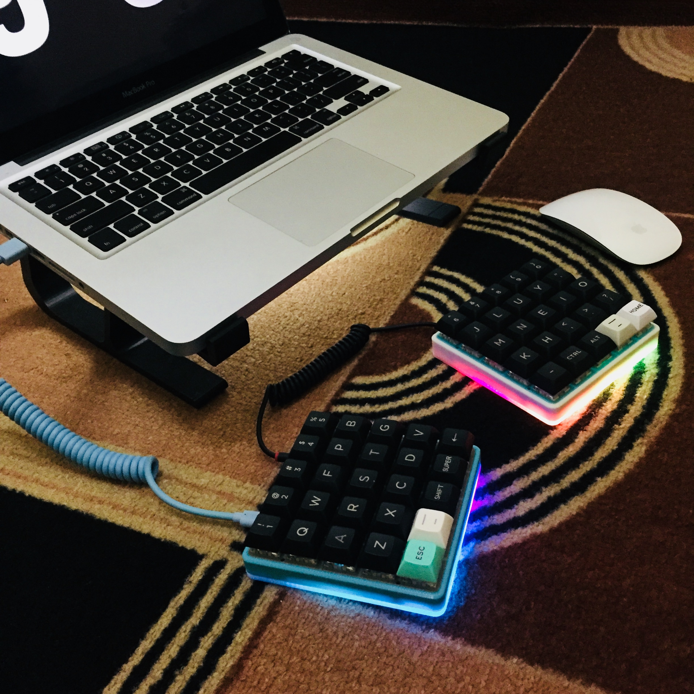
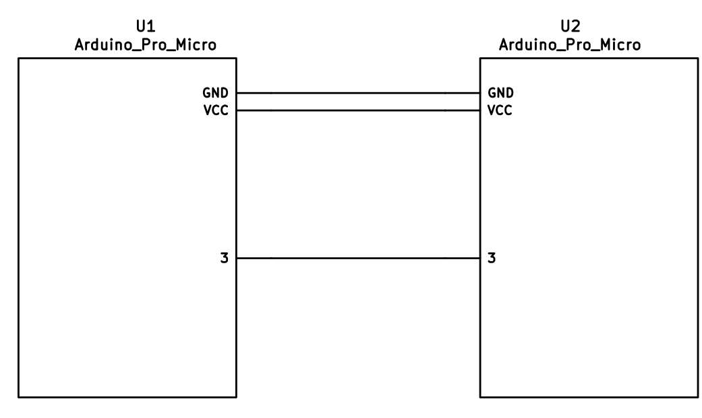
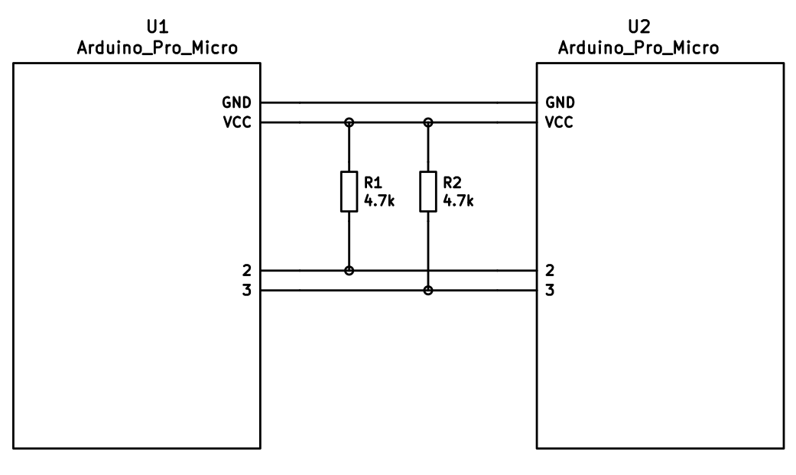

25 RGB Underglow
===============

This is a modification of the TMK firmware by ahtn found here https://github.com/ahtn/tmk_keyboard/tree/master/keyboard/split_keyboard

COL_PINS { F4, F5, F6, F7, B1 }

ROW_PINS { D4, C6, D7, E6, B4 }

PCB's design by di0ib (40percent.club), can be found here
https://github.com/di0ib/Misc/tree/master/25

Custom split keyboard firmware
======

Split keyboard firmware for Arduino Pro Micro or other ATmega32u4
based boards.

RGB Underglow + Case
--------------------

Make some modification, Colemak layout and RGB Underglow. Also 3d printing case








Features
--------

Some features supported by the firmware:

* Either half can connect to the computer via USB, or both halves can be used
  independently.
* You only need 3 wires to connect the two halves. Two for VCC and GND and one
  for serial communication.
* Optional support for I2C connection between the two halves if for some
  reason you require a faster connection between the two halves. Note this
  requires an extra wire between halves and pull-up resistors on the data lines.

Required Hardware
-----------------

Apart from diodes and key switches for the keyboard matrix in each half, you
will need:

* 2 Arduino Pro Micro's. You can find theses on aliexpress for ≈3.50USD each.
* 2 TRS sockets
* 1 TRS cable.

Alternatively, you can use any sort of cable and socket that has at least 3
wires. If you want to use I2C to communicate between halves, you will need a
cable with at least 4 wires and 2x 4.7kΩ pull-up resistors


Wiring
------

The 3 wires of the TRS cable need to connect GND, VCC, and digital pin 3 (i.e.
`PD0` on the ATmega32u4) between the two Pro Micros.

Then wire your key matrix to any of the remaining 17 IO pins of the pro micro
and modify the `MATRIX_COL_PINS` and `MATRIX_ROW_PINS` in `config.h` accordingly.

The wiring for serial:



The wiring for i2c:



The pull-up resistors may be placed on either half. It is also possible
to use 4 resistors and have the pull-ups in both halves, but this is
unnecessary in simple use cases.

Notes on Software Configuration
-------------------------------

Configuring the firmware is similar to any other TMK project. One thing
to note is that `MATIX_ROWS` in `config.h` is the total number of rows between
the two halves, i.e. if your split keyboard has 4 rows in each half, then
`MATRIX_ROWS=8`.

Also the current implementation assumes a maximum of 8 columns, but it would
not be very difficult to adapt it to support more if required.


Flashing
--------

Before you go to flash the program memory for the first time, you will need to
EEPROM for the left and right halves. The EEPROM is used to store whether the
half is left handed or right handed. This makes it so that the same firmware
file will run on both hands instead of having to flash left and right handed
versions of the firmware to each half. To flash the EEPROM file for the left
half run:
```
make eeprom-left
```
and similarly for right half
```
make eeprom-right
```

After you have flashed the EEPROM for the first time, you then need to program
the flash memory:
```
make program
```
Note that you need to program both halves, but you have the option of using
different keymaps for each half. You could program the left half with a QWERTY
layout and the right half with a Colemak layout. Then if you connect the left
half to a computer by USB the keyboard will use QWERTY and Colemak when the
right half is connected.


