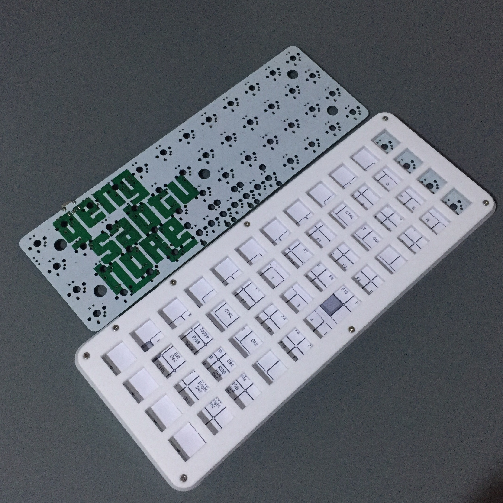
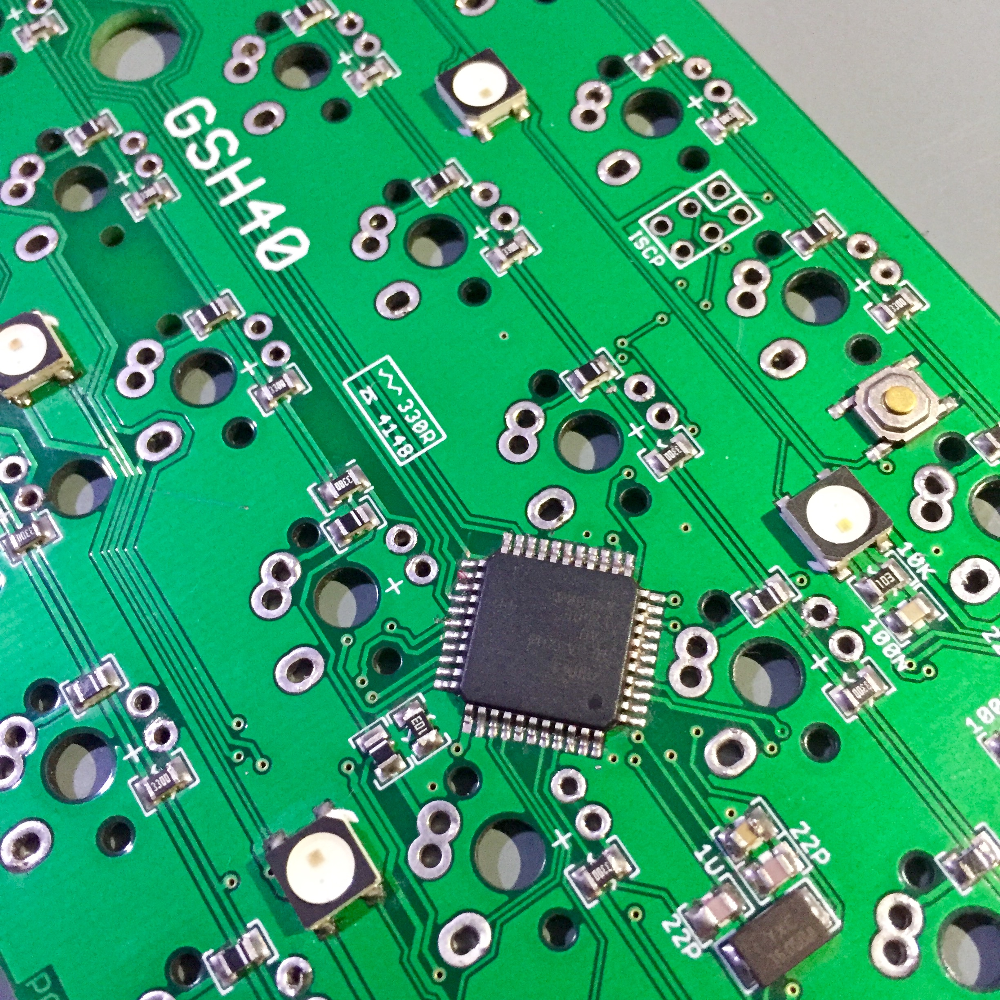

GSH 40 Keyboard
==============

GSH40 is 40% ortholiner keyboard with RGB underglow, base on TMK keyboard

Pinout

    Row       B3  B1  B0  E6
    
    Coloumn   F0  F1  F7  C7  C6  B5  B4  D7  D6  D4  D5  D3

